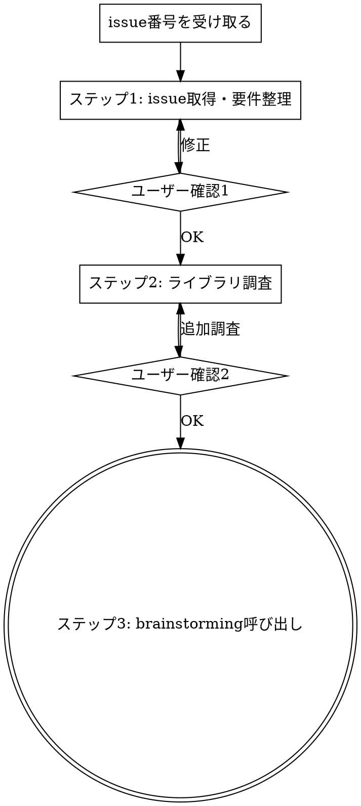

# handle-issue

GitHub issue番号を受け取り、要件理解・ライブラリ調査を行い、superpowersフローに接続する。BoardGameChestプロジェクト専用。

## フロー

**ステップは飛ばせない。例外なし。**

## ステップ1: issue取得と要件整理

1. `gh issue view <番号>` でissueの本文・ラベル・コメントを取得
2. 設計ドキュメントを参照し、関連する機能スコープ・既存設計を特定:
   - `docs/prd.md` — 機能要件、スコープ、ユーザーストーリー
   - `docs/design.md` — DBスキーマ、API設計、ディレクトリ構成
   - `docs/adr.md` — 技術選定の比較検討記録
3. ユーザーに提示:
   - issueの要約
   - 関連する設計ドキュメントの該当セクション
   - 影響範囲（DB、API、UI等）
   - 調査対象ライブラリの一覧
4. **確認:** 「この理解で合っていますか？調査対象のライブラリを追加・削除しますか？」

## ステップ2: ライブラリ調査

1. `package.json` から関連ライブラリの現在バージョンを確認（未初期化ならスキップ）
2. Web検索で各ライブラリについて取得:
   - 最新バージョンと現在バージョンの差分
   - Breaking Changes
   - ベストプラクティス
   - よくあるハマりポイント
3. ライブラリが2つ以上なら `superpowers:dispatching-parallel-agents` で並列調査
4. 結果をテーブル形式で提示:

| ライブラリ | 現在ver | 最新ver | 注意点・ベストプラクティス |
|---|---|---|---|

5. **確認:** 「brainstormingに進みますか？追加で調べることはありますか？」

## ステップ3: superpowersフローへの接続

1. `superpowers:brainstorming` をSkillツールで呼び出す
2. brainstorming → writing-plans への引き継ぎはbrainstormingスキルの責務

**本スキルの終了地点:** brainstorming呼び出し時点。

## エラーケース

| ケース | 対処 |
|---|---|
| issue番号が存在しない | エラーを提示し再入力を求める |
| issueがクローズ済み | その旨を伝え続行するか確認 |
| 設計ドキュメントに該当なし | 新規機能として影響範囲を広めに検討 |
| ライブラリ情報が見つからない | 報告し代替情報源を確認 |
| ユーザーが「いいえ」 | 修正点を聞き再提示 |

## Red Flags — これらの考えが浮かんだら止まれ

| 考え | 現実 |
|---|---|
| 「このissueはシンプルだからbrainstorming不要」 | シンプルに見えるissueほど前提の見落としがある。必ず経由する |
| 「ライブラリ調査は不要、既に知っている」 | 知識は古い可能性がある。最新情報を必ず取得する |
| 「設計ドキュメントは関係なさそう」 | 影響範囲は確認するまで分からない。必ず参照する |
| 「直接コードを書き始めた方が早い」 | 手戻りの方がはるかにコストが高い。フローに従う |
| 「ユーザー確認は省略して先に進もう」 | 的外れな作業を防ぐために確認は必須 |
| 「急いでるからステップを飛ばそう」 | 手順を飛ばした手戻りの方が時間がかかる |
| 「ユーザーが不要と言ったからスキップ」 | リスクを説明した上でユーザーに最終判断を委ねる。黙ってスキップしない |

**すべてのRed Flagの対処: フローに戻る。例外なし。**
